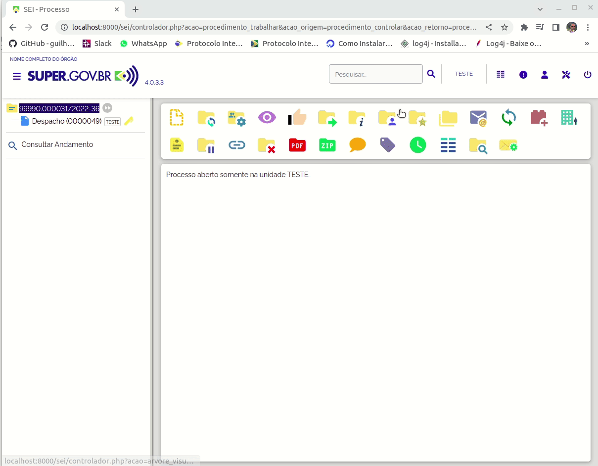

# Módulo de Resposta à plataforma Gov.br

O módulo é o responsável por integrar o Sistema Eletrônico de Informações - SEI à plataforma Gov.br. Tem como objetivo proporcionar respostas tempestivas aos questionamentos executado diretamente por usuário externo, a fim de formar novo processo ou compor processo já existente dos cidadões.


A utilização deste módulo adicionará nova funcionalidade ao SEI, permitindo:
 - Enviar resposta à processos administrativos abertos por meio da plataforma Gov.br

## Manual de Utilização

Esta seção tem por objetivo demonstrar a funcionalidade que será disponibilizada pelo módulo de resposta do SEI à plataforma Gov.br.

### Pré-requisitos
- SEI com acesso externo liberado

### Informações Obrigatórias para Envio da Resposta

Para permitir a interoperabilidade entre o SEI e a plataforma Gov.br, definiu-se um padrão de dados para intercâmbio. Este padrão define atributos que são obrigatórios e/ou opcionais.

Ao enviar resposta, a Plataforma Gov.br, são obrigatórios os campos **processo, mensagem, lista de documentos e resposta conclusiva**. O SEI fará validações das informações pendentes para envio e exibirá mensagens para o usuário, tais como:

- Informe a Mensagem
- Nenhum documento selecionado (Verifica se o foi selecionado pelo menos um documento interno assinado ou se possui algum documento externo)
- Selecione o Tipo de resposta



---


### Consulta às respostas enviadas

O módulo disponibiliza um webservice a respeito das resposta enviadas. Para consultar as respostas geradas, deve-se acessar o serviço, informando para tanto as seguintes informações:

O wsdl do serviÁo pode ser acessado em: ```<SERVIDOR>/sei/modulos/mod-sei-resposta/ws/MdResposta.wsdl```

```php
      <seim:RespostaRequest>
         <SiglaSistema xsi:type="xsd:string"></SiglaSistema>
         <IdentificacaoServico xsi:type="xsd:string"></IdentificacaoServico>
         <!--Optional:-->
         <IdProcedimentos xsi:type="seim:IdProcedimentos">
            <!--0 to 100 repetitions:-->
            <IdProcedimento xsi:type="xsd:int"></IdProcedimento>
         </IdProcedimentos>
         <!--Optional:-->
         <NumProcedimentos xsi:type="seim:NumProcedimentos">
            <!--0 to 100 repetitions:-->
            <NumProcedimento xsi:type="xsd:string"></NumProcedimento>
         </NumProcedimentos>
         <!--0 to 100 repetitions:-->
         <IdResposta xsi:type="xsd:string"></IdResposta>
      </seim:RespostaRequest>
```